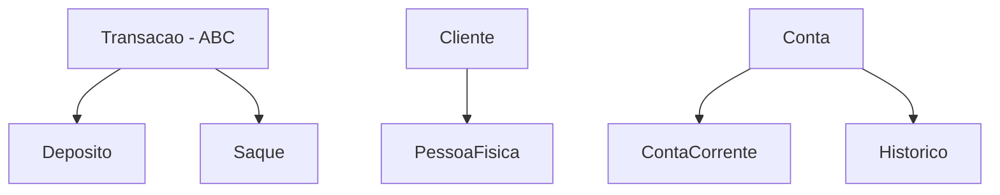

# 🏦 Sistema Bancário POO - Desafio 3 Santander Bootcamp

> Sistema bancário completo desenvolvido em Python com Programação Orientada a Objetos

## 🚀 Funcionalidades

- ✅ **Criação de Clientes** (Pessoa Física)
- ✅ **Criação de Contas Correntes** com limites
- ✅ **Depósitos** com validações
- ✅ **Saques** com múltiplas validações:
  - Limite por transação (R$ 500)
  - Limite de quantidade (3 saques)
  - Verificação de saldo
- ✅ **Histórico de Transações** completo
- ✅ **Extrato Detalhado** com data/hora
- ✅ **Listagem de Contas** cadastradas

## 🎯 Conceitos POO Aplicados

- **🔗 Herança:** `PessoaFisica` → `Cliente`, `ContaCorrente` → `Conta`
- **🔄 Polimorfismo:** Método `sacar()` sobrescrito na `ContaCorrente`
- **🔒 Encapsulamento:** Atributos privados com properties
- **📋 Abstração:** Interface `Transacao` (ABC)
- **🧩 Composição:** `Conta` possui `Historico`
- **🏭 Factory Method:** `@classmethod nova_conta()`

## 🛠️ Como Executar

```bash
python sistema_bancario_poo.py
```

## 📊 Estrutura das Classes



## 🧪 Exemplo de Uso

1. **Criar usuário:** `[nu]`
2. **Criar conta:** `[nc]` 
3. **Depositar:** `[d]` → R$ 1000
4. **Sacar:** `[s]` → R$ 200 (máx R$ 500, 3x por período)
5. **Ver extrato:** `[e]`

## 🎓 Tecnologias

- **Python 3.x**
- **ABC (Abstract Base Classes)**
- **datetime** para timestamp
- **POO** com todos os pilares

---

📚 **Desenvolvido durante o Santander Bootcamp 2025 - DIO**