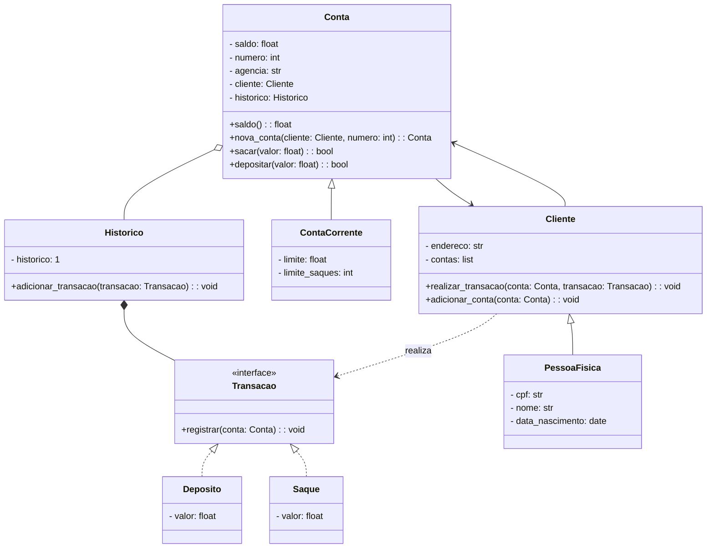

# Desafio 1: Sistema Bancário em POO com Python

Atualize a implementação do sistema bancário para **armazenar os dados de clientes e contas bancárias em objetos**, ao invés de dicionários.

---

## 🎯 Objetivo

O código deve seguir o modelo de classes UML (localizado na pasta `Desafio 3`). Veja abaixo um resumo do modelo de classes:

---

## 🏛️ Modelo de Classes — Sistema Bancário POO

---

### 📦 Classes e Relações

- **Transacao** (Interface)
  - `+registrar(conta: Conta): void`
- **Deposito** / **Saque**
  - `- valor: float`
  - Implementam `Transacao`
- **Historico**
  - `- historico: 1`
  - `+adicionar_transacao(transacao: Transacao): void`
  - Composição com `Conta` (1)
  - Agregação com `Transacoes` (*)
- **Conta**
  - `- saldo: float`
  - `- numero: int`
  - `- agencia: str`
  - `- cliente: Cliente`
  - `- historico: Historico`
  - `+saldo(): float`
  - `+nova_conta(cliente: Cliente, numero: int): Conta`
  - `+sacar(valor: float): bool`
  - `+depositar(valor: float): bool`
  - Associação com `Cliente`
  - Composição com `Historico`
  - Superclasse de `ContaCorrente`
- **ContaCorrente**
  - `- limite: float`
  - `- limite_saques: int`
  - Herda de `Conta`
- **Cliente**
  - `- endereco: str`
  - `- contas: list`
  - `+realizar_transacao(conta: Conta, transacao: Transacao): void`
  - `+adicionar_conta(conta: Conta): void`
  - Associação com `Conta (1..*)`
  - Superclasse de `PessoaFisica`
  - Realiza `Transacao`
- **PessoaFisica**
  - `- cpf: str`
  - `- nome: str`
  - `- data_nascimento: date`
  - Herda de `Cliente`

---

## 🔗 Relações

- **Cliente** realiza **Transacao**
- **Conta** está associada a **Cliente**
- **PessoaFisica** herda de **Cliente**
- **ContaCorrente** herda de **Conta**
- **Conta** contém **Historico**
- **Historico** registra múltiplas **Transacoes**
- **Deposito** e **Saque** implementam **Transacao**

---

# 🚀 Desafio Extra

Após concluir a modelagem das classes e a criação dos métodos, **atualize os métodos que tratam as opções do menu para funcionarem com as classes modeladas**.

